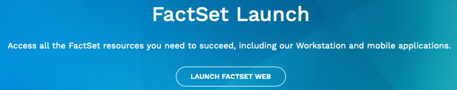
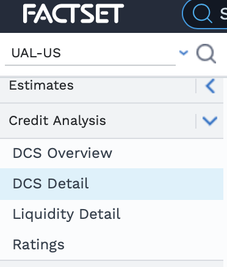
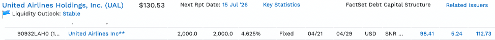
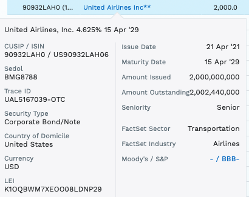
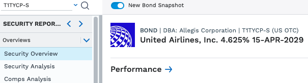
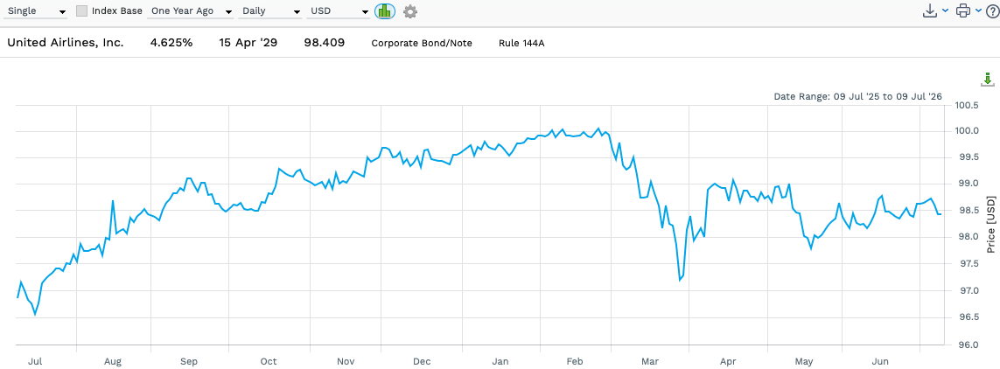
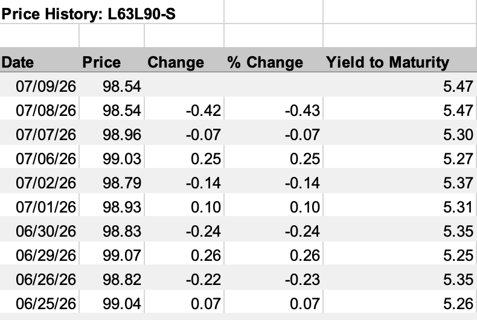

# Accessing FactSet through Columbia Libraries and Selecting Your Portfolio Companies
## ECON 3025: Financial Economics 

---

## What this guide will help you do

1. Access FactSet through the Columbia Libraries.
2. Select a portfolio of **10 companies** that have both publicly traded **stocks** and outstanding **bonds**.
3. Download a first batch of data — stock prices and bond prices — to confirm your selections work.

By the end of this guide you should have be able to download a spreadsheet (in CSV files) of daily stock prices and bond prices for your 10 companies.

---

## 1. Accessing FactSet via Columbia Libraries

FactSet is available to all Columbia students through the Business & Economics Library.

1. Go to **[Columbia Library's FactSet page](https://library.columbia.edu/collections/eresources/databases/factset.html)** and sign in with your UNI and password.
2. If you have not done so yet, create an account clicking **Register for a FactSet Academic account**. Once you have an account, you can click on **Log in to FactSet**.
3. Once you log in, select **"Launch FactSet Web"** as seen below — this is the browser-based version; no installation needed.

4. You should see FactSet's workstration web-based browser version.

> **Off-campus access:** The link above routes through Columbia's proxy server, so it works from anywhere as long as you are signed into the Columbia portal first. If you get a login screen, try opening the link via the library website rather than bookmarking FactSet directly.

---

## 2. Choosing your 10 companies

### Criteria for your portfolio

Each company you select must satisfy **all three** of the following:

| Criterion | Why it matters |
|---|---|
| Listed on a major US exchange (NYSE or NASDAQ) for the past five years ending in the month prior to the month the semester started | Ensures daily stock price data is available to perform CAPM analysis |
| Five out of the ten companies have at least one outstanding standard (fixed coupon rate and semiannual coupon payment) publicly traded bond | Required for the bond-pricing portion of the project |
| Companies follow a theme you find interesting | Makes the portfolio tracking more engaging |

<!-- ### Diversity requirement

Your 10 companies should span **at least 3 different industries** (e.g., Technology, Healthcare, Energy, Consumer Staples, Financials, Industrials, Utilities). This matters because the portfolio theory module of the course will ask you to think about correlations across sectors. -->

### Verifying that a company has traded bonds

Before committing to a company, confirm it has publicly traded bond data in FactSet. Remember at least five out of the ten should have bond data. You can find this information many ways, but you do so by searching for the company equity on the FactSet search bar in the top left of the FactSet web workstation.

1. Open the company's page and navigate to **Credit Analysis → DCS Detail**. Example:

  

2. Scroll down to the `Notes/Bonds` section. You should see a list of outstanding bond issues. Look for at least one bond with a **maturity date over one year in the future, reported prices for at least one year up to the month before the course started (August for Fall Semester, December for Spring Semester), positive coupon rate and fixed coupon type**. Example:

  

3. If no bonds appear for the company, choose a different company. (Many smaller firms issue no public debt.)
4. If a company has multiple bonds, pick the one in the ** five- to ten-year maturity range** (or around then). You can lean on the ones with the biggest amount outstanding and are the most similar to the standard ones covered in class.
5. Once you identify a bond, write its CUSIP (or ISIN) to make it easier to find later on. Example:

  

These last steps are also described by our friends at the **[Library of UVA Darden](https://darden.libguides.com/corporatebonds/factset)**.

> **Tips:** 
>- Large-cap companies (S&P 500 members) almost always have bond data. You can start there to speed up choosing your firms for your portfolio.

### Recording your selections

Create a simple table (in a spreadsheet or a text file you will later read into R) with the following columns:

| company_name | ticker | exchange | stock_cusip_or_isin|bond_selection_cusip_or_isin |
|---|---|---|---|---|
| United Airlines | UAL | NASDAQ | 910047109 |90932LAH0|
| … | … | … | … |…|

The **CUSIP or ISIN** identifies the specific financial security. You will find it on the FactSet page for the stock or the specific bond. Record the CUSIP/ISIN now as it may ease to find the stock or bond later.

### Notes:
- When searching for a company, ensure you select the option for the general listing in the U.S. When searching in FactSet, other options may appear such as listings in other countries or special types of securities. Usually the Symbol listed will be the Ticker next to a `-USA`.

### (Optional) Storing a portfolio of financial assets (stocks or bonds) as a Watchlist in FactSet.

In order to not have to search for the companies you selected every time, you can store them in a Portfolio Watchlist so you can select from a list when needed instead. This also makes it easier to download stock price data as a group later on.

1. Next to user User Setting icon, you'll see a "Create/Edit Watchlist." The middle icon of the ones shown below that appear in the top right of the FactSet web workstation:

  

2. Search for the tickers of the companies and select the company. Do iteratively until you populate the list.

3. Remember to save your Portfolio Watchlist with the save button. The middle icon of the ones shown below that appear in the top right of the FactSet web workstation when forming the watchlist:

  

Save your portfolio under `Porfolios > Personal` with a name of your choosing (i.e. "FINECONPORTFOLIO").

4. On the top banner, click on `Portfolio Monitor` and press the Find Directory icon on the top left of the FactSet web workstation (screenshot: ). In the Identifier Lookup window that opens, you should find your portfolio that you named under `Porfolios > Personal`.

---

## 3. Downloading bond price data from FactSet

Bond price data requires a few extra steps because bonds are identified by CUSIP/ISIN rather than ticker.

1. In FactSet, at the very top enter the CUSIP or ISIN for one of your bonds.
3. Navigate to **Price History**, set a date range, and select **Daily** frequency and ensure the currency is in US Dollars (USD).

  

  

4. In the data table below, click on the download arrow button that should allow you to download the data in Excel format: . The spreadsheet data should include Date, Price and Yield to Maturity. There may be more columns but we'll focus on these for the course assignment.

  

### Notes:
> - **What if bond prices are sparse?** Corporate bonds trade less frequently than stocks, so some days may show no trade. This is normal. Your (R) code (that you will work on with AI in an assignment) can handle missing values by carrying the last observed price forward — sometimes referred to as *last-price imputation*.
> - You can also save specfic bonds as a portfolio watchlist to make it easier to download in bulk from FactSet
---

## 4. Downloading stock price data from FactSet

### Using the FactSet Excel Add-In vs. the web interface

For this project you will **export data to CSV** from the web interface (no Excel add-in needed).

1. From the company's FactSet page, go to **Prices & Returns → Price History**.
2. Set the date range to **September 1, 2026 – December 19, 2026** (adjust to match the semester dates your instructor announces).
3. Select **Daily frequency**, **Adjusted Close** price (adjusts for splits and dividends).
4. Click **Export → Download as CSV**.
5. Repeat for all 10 companies, or use the **Multi-Company** export (see below).

### Multi-company export (faster)

1. In the FactSet, click **Company/Security**.
2. Open your saved portfolio by searching and selecting **Portfolios**.
3. Go to **Prices > Price History**.
4. On the top left, select **Multiple** instead of **Single**.
5. Choose to plot Price, remove the Index Base to ensure you download the actual prices.
6. Choose to relevant date range.
7. Download the data.

---

## 5. Sanity checks before you move on

Before proceeding to creating (R) code scripts, you can verify the following manually when needed:

- You have **10 stock price CSVs** (or one combined file) covering the full relevant data window with no obvious gaps in dates.
- Each bond has a **maturity date after the end of the semester** (so you can track price changes through the semester).
- Stock prices look reasonable — no zeros, no sudden 10× jumps that would indicate a data error (splits should already be adjusted out).
- The company names and tickers in your table match the files you downloaded.

If anything looks wrong, return to FactSet and re-download. It is much easier to fix data problems now than after you have written R code around bad inputs.

---

## 6. What comes next

Once your data files pass the checks above, you are ready for **Step 2: Loading Data into R and Computing Returns**. That step will walk you through reading your CSVs into R, computing holding-period and log returns for both stocks and bonds, and producing your first plots.

---

## Getting help

- **FactSet support:** The Columbia Business & Economics Library offers walk-in and virtual consultations with a subject librarian who specializes in financial data. See [library.columbia.edu/libraries/business](https://library.columbia.edu/libraries/business).
- **Course Slack / Ed Discussion:** Post data questions there — your classmates may have hit the same issue.
- **TA office hours:** Bring your CSV files and your table of company selections. TAs can spot data problems quickly.
